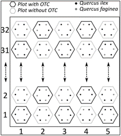

# **Efecto del método de reforestación sobre plántulas de *Quercus spp.* en un escenario de cambio climático**

```{r, echo=FALSE}
knitr::opts_chunk$set(echo = FALSE, fig.align = 'center')
```


```{r, results='asis', fig.cap="Figura 1. Vista general del sitio de estudio"}
knitr::include_graphics("ImagenesRmarkdown/Imagen2.jpg")
```


## **Metodología**

El experimento de campo para la investigación se localiza en la Huerta La Paloma (Fig. 1), una finca muy cercana a la ciudad de Granada y accesible a 15 minutos andando desde la Facultad de Ciencias. Contiene 160 parcelas hexagonales (Fig. 1), 80 de las cuales están cubiertas con una “Open Top Chamber” (OTC), una cámara abierta construida según los estándares internacionales de investigación que simula las condiciones de cambio climático a partir un incremento en la temperatura, influyendo también en el factor humedad. De esta manera se miden tanto las condiciones del lugar como cuál es el efecto de las OTC sobre el ambiente y qué efectos puede tener en el individuo (Fig. 2).


```{r, results='asis', fig.cap="Figura 2. Diseño del experimento. En la finca se establecieron 160 parcelas hexagonales distribuidas en 32 filas de 5 parcelas cada una. La mitad de ellas se someten a un tratamiento experimental de cambio climático (“OTC”). En cada parcela se han establecido individuos de dos especies nativas de *Quercus* por medio de siembra y otros de plantación."}


```


Las especies objetivo a las que se dirige el experimento se han elegido debido a sus altas tasas de establecimiento por el gran tamaño de sus semillas, permitiendo la revegetación mediante ambos métodos. Se trata de dos especies autóctonas del lugar: *Quercus ilex*, un árbol esclerófilo de hoja perenne, y *Q.faginea*, una especie marcescente con mayor demanda de agua. 

En el momento de la siembra, se controló la masa individual de cada una y la identidad del árbol madre. La mitad de las bellotas se sembraron en el campo del experimento y la otra mitad se llevaron a un vivero para su cultivo. En cada parcela hexagonal, se sembraron 3 bellotas de cada una de las especies en otoño de 2020, distribuyéndose una en cada vértice del hexágono que forma la parcela. En el centro del hexágono se puede encontrar otra bellota de alguna de las dos especies, o bien, una sonda de temperatura o humedad.

Como se ha mencionado, se cultivaron simultáneamente plantones provenientes de los mismos lotes de bellotas, y se trasladaron al campo en enero de 2022 (sustituyendo los huecos que no había germinado ningún individuo) junto con los plantones ya establecidos, controlando el tamaño del plantón. Desde ese momento, se monitorizan una serie de variables respuesta y continuará hasta septiembre de 2023 con el fin de evaluar los efectos de sembrar y plantar más allá del año de plantación.

Las tareas específicas llevadas a cabo en este proyecto incluyen: 

•	**Mantenimiento**: Periódicamente, se lavan las OTC para asegurar su transparencia a la radiación UV (Fig. 3) y se van desbrozando manualmente las hierbas para evitar que la competencia interfiera con el experimento. 
Además, se descargan periódicamente los datos de temperatura de los registradores de datos instalados, situados dentro y fuera de las cámaras.

```{r, results='asis', fig.cap="Figura 3. Mantenimiento OTC", fig.width=5}


```

•	**Mediciones**: Se han realizado con el fin de establecer el efecto de los factores de estudio (método de revegetación, OTC y especie) sobre el desarrollo de las plántulas. 
Para evaluar estos efectos, se cuantifican los siguientes parámetros: emergencia, supervivencia, rebrote, crecimiento, clorofila y potencial hídrico foliar. 
Las medidas de las variables respuesta se tomaron generalmente en distintos momentos: sin estrés (finales de primavera), estrés inicial (mediados de verano), estrés máximo (antes de las primeras lluvias de otoño) y recuperación tras el estrés (mediados de otoño). Además, se han medido periódicamente las variables de humedad del suelo y temperatura.  

•	**Estudio estadístico y redacción**: Los datos obtenidos se analizarán mediante modelos de efectos mixtos (generalizados), evaluando el efecto del método de revegetación, las OTC y su interacción en las respuestas de las plantas. La masa de las bellotas constituirá una covariable, así como la posición de la parcela en el campo, dada la existencia de un gradiente natural de fertilidad. Tendremos en cuenta la identidad del árbol madre y de la parcela como efectos aleatorios. 

## **Visualización de los datos de campo**

Este ejercicio de esta asignatura me será útil para visualizar los datos tomados en campo y tener una idea previa al análisis de los mismos. Para ello voy a crear a continuación una serie de tablas donde se mostrarán las variables respuesta medidas en función de los factores que les afecta.

PD: Estas tablas se han generado en una base de datos específica de otro script de R que será el correspondiente al posterior análisis estadístico. Para ello se han integrado todas las variables y se ha trabajado con ellas para crearlas. Un ejemplo de las funciones utilizadas en este código sería el siguiente: 

*tabla1 <- datos_analisis %>% 
  group_by(otc, `survival aug22`) %>% 
  summarise(N =n())*
            
Sin embargo, para simplificar el proceso, crearé una tabla simple en cada chunk con estos datos.

### Tabla relación presencia/ausencia OTC - Supervivencia

```{r}
library(knitr)
Tabla_otc_supervivencia <- data.frame(OTC = c("1", "1", "0", "0"),
                    Supervivencia = c("0", "1", "0", "1"),
                    N = c("419", "115", "317", "233"))
kable(Tabla_otc_supervivencia, caption = "Tabla 1. Tabla de agrupamiento de indivuduos en función de la relación OTC-supervivencia")
```

Gracias a esta tabla (Tabla 1) podemos observar que generalmente hay una mayor proporción de mortalidad de los individuos en el tratamiento de presencia de OTC en comparación con el tratamiento en ausencia de ésta. 

### Tabla relación Método de revegetación - Supervivencia

```{r}
Tabla_metodo_supervivencia <- data.frame(Met.Reveg = c("P", "P", "S", "S"),
                    Supervivencia = c("0", "1", "0", "1"),
                    N = c("401", "121", "335", "227"))
kable(Tabla_metodo_supervivencia, caption = "Tabla 2. Tabla de agrupamiento de indivuduos en función de la relación método de revegetación-supervivencia")
```

Gracias a esta tabla (Tabla 2) podemos observar que generalmente hay una mayor proporción de mortalidad de los individuos sembrados en comparación con aquellos que se han plantado. 

### Tabla relación Especie - Supervivencia

```{r}
Tabla_especie_supervivencia <- data.frame(Especie = c("Qf", "Qf", "Qi", "Qi"),
                    Supervivencia = c("0", "1", "0", "1"),
                    N = c("411", "160", "325", "188"))
kable(Tabla_especie_supervivencia, caption = "Tabla 3. Tabla de agrupamiento de indivuduos en función de la relación especie-supervivencia", position = "footnote")
```

En esta tabla (Tabla 3) podemos observar que generalmente hay una mayor proporción de mortalidad de los individuos de *Q. faginea*, por lo que podemos inferir que la especie va a determinar el éxito de supervivencia independientemente de los factores a los que esté sometida la plántula

### Gráfica relación Peso Bellota - Media altura

```{r, fig.cap="Figura 7. Gráfica de relación de variables OTC-supervivencia"}
Relacion_peso_altura <- data.frame(
  x = c(2.14, 2.16, 2.32),
  y = c(14.1, 19.8, 20.2)
)
library(ggplot2)
ggplot(Relacion_peso_altura, aes(x = x, y = y)) +
  geom_line() +
  labs(title = "Relación Peso-Altura", x = "Peso bellota", y = "Media altura") +
  theme_bw()
```
En esta gráfica (Figura 7) podemos ver una relación directa entre el peso de la bellota y la media de la altura de la plántula, ya que a simple vista podemos ver que a mayor peso de la bellota, mayor altura alcanza como variable respuesta, evidentemente sin tener en cuenta los efectos de los tratamientos a los que están sometidas las plántulas.

### Gráfica relación Peso Bellota - Media área

```{r, fig.cap="Figura 8. Gráfica de relación de variables OTC-supervivencia"}
Relacion_peso_area <- data.frame(
  x = c(2.14, 2.16, 2.32),
  y = c(7.55, 9.08, 12.4)
)
library(ggplot2)
ggplot(Relacion_peso_area, aes(x = x, y = y)) +
  geom_line() +
  labs(title = "Relación Peso-Área", x = "Peso bellota", y = "Media área") +
  theme_bw()
```
En esta gráfica (Figura 8) también podemos ver una relación directa entre el peso de la bellota y la media del área de la plántula, ya que a simple vista podemos ver que a mayor peso de la bellota, mayor área posee como variable respuesta, evidentemente sin tener en cuenta los efectos de los tratamientos a los que están sometidas las plántulas.

**ACLARACIÓN:**
**Esto es sólo son observaciones a simple vista, tendremos que comprobar estas tendencias con un análisis estadístico.**

```{r setup, include=FALSE}
knitr::opts_chunk$set(echo = TRUE)
```

